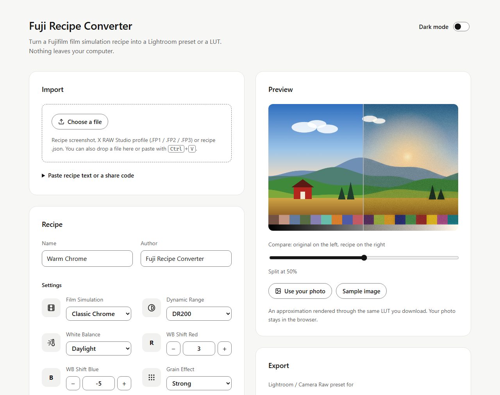

<h1 align="center">Fuji Recipe Converter</h1>

<p align="center"><b>Your recipe. Your photos. Your machine. Offline, in the browser, no account.</b></p>

<p align="center"><sub>Turn a Fujifilm film simulation recipe into a Lightroom preset or a LUT.</sub></p>

<p align="center">
  
  
  
  
  
  <a href="LICENSE"></a>
</p>

<p align="center">
  <a href="#get-started">⬇&nbsp;Get started</a> ·
  <a href="#features">Features</a> ·
  <a href="#using-the-exports">Using the exports</a> ·
  <a href="#how-a-recipe-is-translated">How it works</a> ·
  <a href="#how-accurate-is-it">Accuracy</a> ·
  <a href="#disclaimer">Disclaimer</a>
</p>

<p align="center">
  <picture>
    <source media="(prefers-color-scheme: dark)" srcset="docs/assets/screenshot-dark.png">
    
  </picture>
</p>
<p align="center"><sub>Type or import a recipe, check it on a photo, download a preset or a LUT. Light and dark mode included.</sub></p>

---

## Get started

No installer and nothing to build.

1. Download this repository (green **Code** button → **Download ZIP**) and unzip it, or `git clone` it.
2. Start the app:

| System | How |
|---|---|
| **Windows** | Double-click **`start.bat`** |
| **macOS / Linux** | Run **`./start.sh`** in a terminal. Needs Python 3, which most systems already have. |

Your browser opens at `http://localhost:8173/`. Keep the small terminal window open while you use the app; close it to stop.

> **Without the start script.** You can also just double-click `index.html`. Everything works except
> reading screenshots, because browsers block the OCR engine on pages opened straight from disk.
> The library is stored per address, so recipes saved one way are not visible the other way — use
> *Back up library* / *Restore library* to move them.

Everything runs **offline**. The start script serves this folder to your own computer only (`localhost`); nothing is reachable from the network.

---

Fuji Recipe Converter is a small, fully **offline** web page that reads a Fujifilm
film simulation recipe — typed in, pasted, read from a screenshot, or loaded from an
X RAW Studio profile — and writes it out as a **Lightroom / Camera Raw preset
(`.xmp`)** or a **3D LUT (`.cube`)** for DaVinci Resolve, Premiere Pro, Final Cut
and others.

It exists for one reason: to let someone who likes a recipe use that look on
**their own photos and footage**, in the editor **they** already work in.

> **Not affiliated with Fujifilm or Adobe.** This is an independent, unofficial
> interoperability project. It is not affiliated with, endorsed by, or connected to
> FUJIFILM Corporation or Adobe Inc. Their names are used only to say what the tool
> works with. **Results are approximations**, not reproductions, of in-camera
> processing. See [Disclaimer](#disclaimer).

---

## Contents

- [Why](#why)
- [Features](#features)
- [Using the exports](#using-the-exports)
- [How a recipe is translated](#how-a-recipe-is-translated)
- [How accurate is it?](#how-accurate-is-it)
- [Architecture](#architecture)
- [Accessibility](#accessibility)
- [Privacy](#privacy)
- [Attribution](#attribution)
- [Disclaimer](#disclaimer)
- [License](#license)

---

## Why

A recipe is a handful of camera settings. It should not be locked to one camera body.

- **Use the look anywhere.** Apply a recipe to RAW files you already shot, to photos
  from a different camera, or to video.
- **Local and account-free.** The page makes no network requests. Recipes, photos and
  screenshots stay on your computer.
- **Bring recipes in any shape.** Type the values, paste text from a website, drop a
  screenshot, or open an X RAW Studio profile.
- **Transparent math.** Every film simulation is described in plain numbers in one
  file, in the same units as Lightroom's sliders. The app shows every value it writes
  into a preset before you download it. The looks are approximations of — not
  reproductions of — any proprietary colour science.

---

## Features

| Area | What you get |
|---|---|
| **Recipe editor** | Every setting from the camera's image quality menu, with the same names and ranges: film simulation, dynamic range, white balance and R/B shift, grain, Color Chrome Effect and FX Blue, color, sharpness, highlight, shadow, noise reduction, clarity, monochromatic color. |
| **Import** | Screenshot (text is read on your computer with OCR), X RAW Studio profile (`.FP1` / `.FP2` / `.FP3`), pasted text, share code, recipe file. Drag and drop or paste with <kbd>Ctrl</kbd>+<kbd>V</kbd>. |
| **Preview** | Built-in sample scene or your own photo, with a before/after slider. Rendered through the same LUT you download. |
| **Lightroom preset** | `.xmp` in three variants: Fujifilm RAW, RAW from another camera, JPEG / TIFF / HEIC. |
| **LUT** | `.cube` in 17, 33 or 65 point sizes. |
| **Library** | Save favourites in the browser, back up and restore as a file. Four starter recipes included. |
| **Share** | Short share code, link, plain text, or recipe file. |
| **Interface** | Light and dark mode, keyboard and screen-reader friendly, works down to phone width. |

---

## Using the exports

### Lightroom preset (`.xmp`)

| App | How to import |
|---|---|
| **Lightroom Classic** | Develop → Presets panel → **+** → *Import Presets…* |
| **Lightroom (desktop)** | Edit → Presets → **…** → *Import Presets…* (syncs to mobile) |
| **Camera Raw / Photoshop** | Presets panel → **…** → *Import Profiles & Presets…* |

The preset appears in a group called **Fuji Recipes**. Choose the variant that matches your files:

| Variant | Film simulation comes from | White balance |
|---|---|---|
| **Fujifilm RAW (.RAF)** | Adobe's own *Camera Matching* profile for that simulation — the closest match | Set to the recipe's value, including the R/B shift |
| **RAW from another camera** | Emulated with tone curve, HSL and colour grading | Set to the recipe's value, including the R/B shift |
| **JPEG / TIFF / HEIC** | Emulated, as above | Only the R/B shift, as a relative adjustment |

The preset only touches settings the recipe controls. Exposure, crop, lens corrections and masks are left alone.

### LUT (`.cube`)

| App | Where |
|---|---|
| **DaVinci Resolve** | Project Settings → Color Management → *Open LUT Folder*, copy the file there, *Update Lists*, then apply it on a node |
| **Premiere Pro** | Lumetri Color → Creative → Look → *Browse…* |
| **Final Cut Pro** | Effects → *Custom LUT* |
| **Photoshop** | Layer → New Adjustment Layer → *Color Lookup…* |

The LUT expects normal **Rec.709 / sRGB** footage. For log footage, convert to Rec.709 first and put this LUT after the conversion. Use the 33-point size unless you have a reason not to.

---

## How a recipe is translated

A recipe is two things: a **film simulation** (a complete colour and tone rendering) and a set of **adjustments** on top of it.

| Recipe setting | Lightroom preset | LUT | Notes |
|---|---|---|---|
| Film Simulation | Camera Matching profile (Fujifilm RAW) or tone curve + HSL + colour grading (other files) | Included | Emulated looks are hand-tuned, relative to PROVIA / Standard |
| Dynamic Range | Highlights −20 (DR200) / −40 (DR400) | Softer highlight shoulder | In camera this changes exposure too; here only the highlight roll-off is imitated |
| White Balance | Temperature / Tint (RAW) | Not included | The scene's light is unknown once a file is developed |
| WB Shift R / B | Folded into Temperature / Tint, or a relative shift | Included as a colour cast | |
| Highlight / Shadow | Point tone curve | Included | |
| Color | Saturation | Included | |
| Color Chrome Effect / FX Blue | HSL luminance of the affected colours | Included | |
| Monochromatic Color (WC / MG) | Global colour grade | Included | Black-and-white simulations only |
| Grain Effect / Size | Grain amount / size | **Not possible** | Shown in the preview |
| Clarity | Clarity | **Not possible** | Shown in the preview |
| Sharpness | Sharpening amount | **Not possible** | |
| Noise Reduction | Luminance noise reduction | **Not possible** | |
| ISO, Exposure Compensation, Camera | — | — | Kept as notes with the recipe |

A LUT changes each pixel's colour on its own, so anything that depends on neighbouring pixels (grain, clarity, sharpening, noise reduction) cannot be stored in it.

---

## How accurate is it?

- **Fujifilm RAW + Lightroom preset** is the most faithful path: Adobe's Camera Matching
  profiles are built to match the camera, and this tool adds the recipe's adjustments on top.
- **Other cameras, JPEGs and LUTs** use this project's own emulation of each film
  simulation. The character is right — Classic Chrome is muted with deep blues, Eterna
  is flat and soft — but the numbers are estimates, not measurements.
- **The preview** is rendered through the same LUT you download, so it shows what the
  LUT does. A Lightroom preset will look similar but not identical, because Lightroom
  does its own maths.
- If the camera itself wrote the recipe's white balance into the RAW file and the recipe
  uses *Auto* white balance, the preset applies the R/B shift a second time. Lower the
  colour grade *Global* saturation to taste.

> **Not yet verified.** Presets are checked to be well-formed and to carry the intended
> values, but have not been compared side by side against camera JPEGs. The Adobe profile
> names for a few newer simulations (REALA ACE, Nostalgic Neg., ETERNA Bleach Bypass) are
> best guesses. If Lightroom shows "profile missing", please open an issue with the exact
> profile name it lists for your camera. The names live in one place: [`js/data.js`](js/data.js).

---

## Architecture

Plain HTML, CSS and JavaScript. No framework, no build step, no dependencies to install.

```
index.html        the app
css/styles.css    styling, light and dark themes
js/data.js        film simulations, fields, defaults, starter recipes
js/engine.js      colour engine: recipe → look → LUT / preview
js/export.js      .xmp, .cube, text and share-code writers
js/parser.js      importers: text, OCR output, .FP1/.FP2/.FP3, share codes
js/app.js         user interface
js/icons.js       icon set
vendor/tesseract  OCR engine (runs locally)
tests/tests.html  open in a browser to run the tests
start.bat / start.ps1 / start.sh   local start scripts
```

- **One description, three outputs.** [`js/engine.js`](js/engine.js) turns a recipe into a
  "look" in Lightroom-style units. The preview, the LUT and the emulated preset are all
  produced from that one look.
- **Tuning a film simulation** means editing its entry in [`js/data.js`](js/data.js).
- **Sharing links.** *Copy link* produces an address ending in `#r=…`, which opens the
  recipe on any copy of this app served at the same address. Publish your copy with
  GitHub Pages and the links work for anyone; otherwise share the code or the recipe
  file, which work on every copy.

---

## Accessibility

Built to meet WCAG 2.2 AA:

- everything works with the keyboard alone, with a visible focus indicator and a *skip to content* link;
- every control has a text label; icons are decorative and hidden from screen readers;
- status changes (imports, downloads, errors) are announced to screen readers;
- text contrast is at least 4.5:1 and control outlines at least 3:1, in both themes;
- follows your system's light/dark, reduced-motion and high-contrast settings; the *Dark mode* switch in the top right corner overrides the system theme and remembers your choice;
- layout reflows down to phone width and works at 200% zoom;
- nothing relies on colour alone, and no action needs dragging.

This has not been through a formal audit. If something does not work with your assistive technology, please open an issue.

---

## Privacy

- No network requests, no analytics, no account.
- Photos and screenshots are processed in your browser and never uploaded.
- Saved recipes and your theme choice live in your browser's local storage for this page.

---

## Attribution

- **Icons:** [Lucide](https://lucide.dev), ISC licence.
- **OCR:** [Tesseract.js](https://github.com/naptha/tesseract.js) and
  [Tesseract](https://github.com/tesseract-ocr/tesseract), Apache License 2.0.
- **X RAW Studio profile format:** field names learned from publicly shared profile files.
  No Fujifilm software, profiles or data are included.

Full notices are in [`THIRD-PARTY-NOTICES.md`](THIRD-PARTY-NOTICES.md).

---

## Disclaimer

- This is an independent project. It is **not affiliated with, endorsed by, or sponsored
  by** FUJIFILM Corporation, Adobe Inc. or Blackmagic Design.
- FUJIFILM, PROVIA, Velvia, ASTIA, ACROS, ETERNA, REALA and related film simulation names
  are trademarks of FUJIFILM Corporation. Adobe, Lightroom and Camera Raw are trademarks
  of Adobe Inc. DaVinci Resolve is a trademark of Blackmagic Design Pty. Ltd. These names
  are used only to describe compatibility.
- The repository contains **no** Fujifilm or Adobe software, camera profiles, LUTs, logos
  or icons. Film simulation looks are this project's own hand-tuned approximations.
- Recipes you import belong to whoever wrote them. Credit the author when you share one.
- The software is provided "as is", without warranty of any kind.

---

## License

Code: [MIT](LICENSE). Bundled third-party components keep their own licences — see [`THIRD-PARTY-NOTICES.md`](THIRD-PARTY-NOTICES.md).
